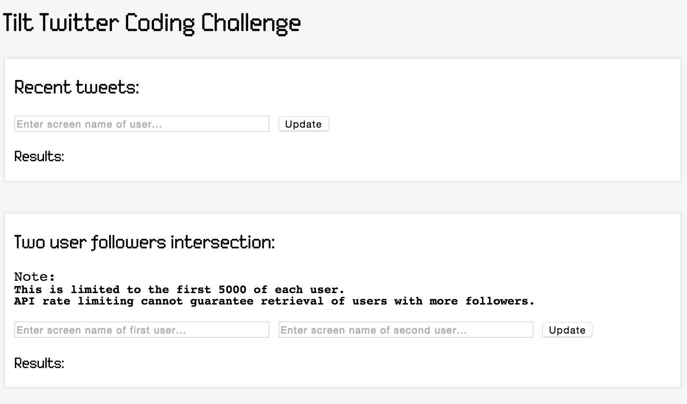

# Install instructions for Tilt-Twitter for MAC OS X

## Install Dependencies
### Perl
	$ brew install perl
	$ curl -L http://cpanmin.us | perl - --sudo YAML
	$ curl -L http://cpanmin.us | perl - --sudo JSON
	$ curl -L http://cpanmin.us | perl - --sudo Dancer
	$ curl -L http://cpanmin.us | perl - --sudo LWP # LWP should already be installed
	$ curl -L http://cpanmin.us | perl - --sudo URI::Encode
	$ curl -L http://cpanmin.us | perl - --sudo IO::Socket::SSL
	$ curl -L http://cpanmin.us | perl - --sudo LWP::Protocol::https
	$ curl -L http://cpanmin.us | perl - --sudo URI::Query
### Bower
	$ brew install node
	$ npm install -g bower

### Git Project
	$ git clone git@github.com:caffed/tilt-twitter.git
	$ cd tilt-twitter
	$ bower install

## Link Dancer
- Make sure the `dancer` script is in you $PATH
	- for brew it is: `/usr/local/Cellar/perl/{{ VERSION }}/bin/`

## Add Twitter Key and Secret
- Add you consumer key and secret to the `environments/development.yml` and `environments/production.yml`
  - See [https://dev.twitter.com/oauth/application-only](https://dev.twitter.com/oauth/application-only) for more info.

## Run project
	$ ./bin/app.pl

## Open Page in Browser
	http://localhost:3000/

